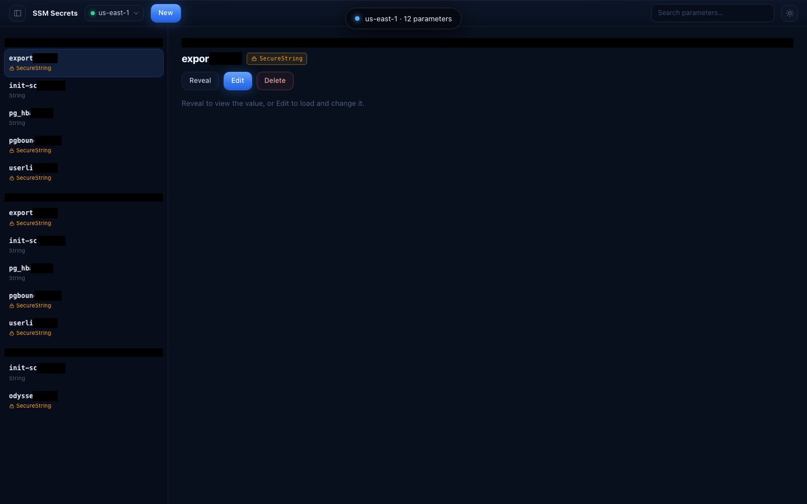
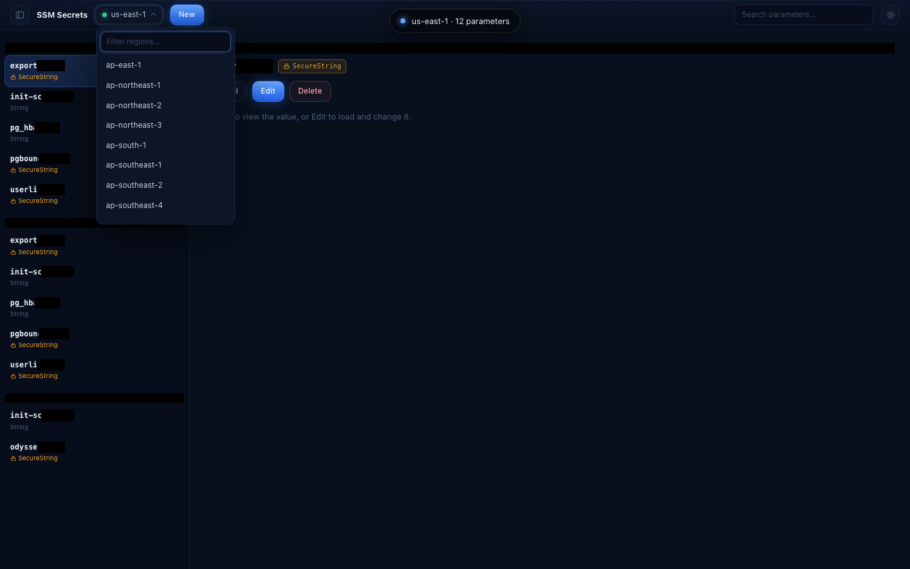
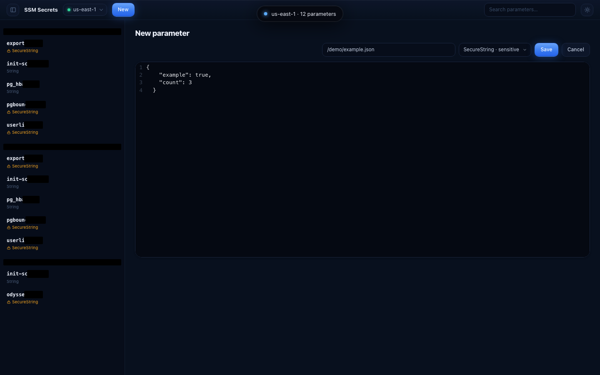

# SSM Secrets

A local, single-user **admin UI + CLI** for **AWS SSM Parameter Store** — browse, reveal,
create, edit, and delete parameters across regions, with a deliberate reveal gate,
passphrase-protected writes, dynamic region discovery, and a local SQLite audit log.

> **Local & single-user.** The server binds to `127.0.0.1` only. Decrypted values are shown
> exclusively through an explicit, audited reveal and are **never persisted or logged**.

---

## Screenshots



*Grouped parameter list — path muted, leaf bold — with **sensitive** (`SecureString`, lock + amber)
clearly distinguished from **general** (`String` / `StringList`) parameters. A “Dynamic Island”
status/command pill sits up top; no modal pop-ups.*



*Regions are fetched **live from your account** (EC2 `DescribeRegions`) and filtered as you type.*



*Create a parameter and pick its type; the value is edited in a CodeMirror editor with syntax
highlighting chosen by file extension.*

> Screenshots live in [`docs/screenshots/`](docs/screenshots/). See that folder's README for how
> to regenerate them — and the safety note: **never capture a *revealed* value** (it would leak a
> secret into the repo).

---

## Key features

- **Master–detail admin UI, no modals.** A morphing *Dynamic Island* pill carries transient state
  (status, reveal confirm, passphrase entry, saving, saved, delete confirm, errors).
- **Sensitive vs general at a glance.** `SecureString` parameters show a lock + amber accent;
  `String` / `StringList` show a neutral badge — in both the list and the detail header.
- **Gated reveal.** Decrypted values are shown only after an explicit confirm (the **Reveal** action)
  or when you open **Edit** (auto-loads the current value). Both go through one audited endpoint.
- **Syntax-highlighted editor.** CodeMirror 6 picks a language from the parameter's file extension
  (`.sh`, `.json`, `.yaml`/`.yml`, `.ini`/`.conf`/`.dsn`, plain).
- **Passphrase-gated writes.** Create / update / delete require a server-verified passphrase
  (`SSM_UI_PASSPHRASE`), compared in constant time. Choose the **type** when creating.
- **Dynamic region switcher.** Region list is fetched from your account and validated per request;
  switching re-scopes all reads/writes. Falls back to a curated static list if discovery fails.
- **Comfortable shell.** Light/dark theme toggle and a collapsible, width-resizable sidebar — both
  persisted in `localStorage`.
- **Local audit log.** Every `list` / `reveal` / `set` / `delete` is recorded in SQLite
  (`.memory/app.db`) — with the region, but **never the value**.
- **CLI** for quick `list` / `get` / `set`.

---

## Architecture

Two entry points — the **CLI** (`src/cli.js`) and the **web server** (`src/server/`) — share a thin
**AWS layer** (`src/aws/`) and a **SQLite memory** module (`src/memory.js`). The frontend
(`web/`, React + Vite) talks to the server over a small JSON API using a `{ ok, data?, error? }`
envelope.

```
┌──────────────────────────────────────────────────────────────────┐
│  Browser — React 18 + Vite 5  (served at 127.0.0.1)                │
│  Toolbar · RegionSwitcher (filter) · ParameterList · DetailPanel   │
│  CodeEditor (CodeMirror 6) · DynamicIsland · ThemeToggle           │
│  App.jsx = operation state machine (reveal/edit/create/delete)     │
└───────────────┬────────────────────────────────────────────────────┘
                │  fetch /api/*   →   { ok, data?, error? }
┌───────────────▼────────────────────────────────────────────────────┐
│  Express server — src/server/                                       │
│  app.js (factory) · routes/secrets.js (region-validated,            │
│  passphrase-gated) · middleware/{errors,passphrase}.js              │
│  index.js bootstrap: per-region SSM client cache +                  │
│                      cached region resolver (+ static fallback)     │
└───────┬─────────────────────────────────────────┬──────────────────┘
        │                                           │
┌───────▼─────────────────────┐         ┌───────────▼──────────────────┐
│  AWS layer — src/aws/        │         │  Memory — src/memory.js       │
│  ssm.js  (list/get/save/del) │         │  SQLite (better-sqlite3)      │
│  regions.js (DescribeRegions)│         │  kv + audit tables → .memory/ │
│  credentials.js (env→shared) │         └───────────────────────────────┘
└───────┬─────────────────────┘
        │  @aws-sdk/client-ssm · @aws-sdk/client-ec2
┌───────▼─────────────────────┐
│  AWS account                 │
│  SSM Parameter Store          │
│  EC2 DescribeRegions          │
└──────────────────────────────┘
        ▲
        │ shares the AWS + memory layers
   src/cli.js  (list · get · set)
```

**Backend layout**

| Path | Responsibility |
|---|---|
| `src/aws/credentials.js` | Resolve credentials (ENV first, then shared profile) and the default region. **The only place credentials are read.** |
| `src/aws/ssm.js` | SSM operations: `listSecrets`, `getSecret`, `saveSecret`, `deleteSecret`. |
| `src/aws/regions.js` | EC2 `DescribeRegions` (enabled regions only). |
| `src/server/regions.js` | Curated static fallback list, `DEFAULT_REGION`, `isAllowedRegion`. |
| `src/server/routes/secrets.js` | `/api/secrets` routes — region validated per request, mutations gated. |
| `src/server/app.js` | Express app factory (`/api/regions`, `/api/secrets`, static UI, error handler). |
| `src/server/index.js` | Bootstrap: per-region SSM client cache + cached `getRegions()` resolver. |
| `src/server/middleware/` | `errors.js` (AWS → HTTP mapping, `asyncHandler`), `passphrase.js` (timing-safe gate). |
| `src/memory.js` | SQLite `kv` + `audit` tables. All persistence goes through here. |

---

## Security model

- **Localhost only** — the server listens on `127.0.0.1`; nothing is exposed off-box.
- **Decrypted values** are surfaced only through `GET /api/secrets/value` — used by both **Reveal**
  (explicit confirm) and **Edit** (auto-load). It is audited as `reveal` and the value is **never**
  written to the audit `meta`, the `kv` table, server logs, or browser storage.
- **Mutations** (`create` / `update` / `delete`) require the server-verified passphrase
  `SSM_UI_PASSPHRASE` (constant-time compare). The passphrase is never logged or stored. Without it,
  mutating routes return `503`.
- **Region** is validated per request against the live allowlist (the set discovered from your
  account, or the static fallback). Region is non-sensitive and may appear in the audit log.
- **Credentials** are read only via `src/aws/credentials.js` (ENV, then shared profile) — never
  hardcoded.

**Required IAM** (see [`docs/iam-policy.json`](docs/iam-policy.json)):
`ssm:GetParametersByPath`, `ssm:GetParameter`, `ssm:PutParameter`, `ssm:DeleteParameter`,
`ec2:DescribeRegions`.

---

## Prerequisites

- **Node.js 18+** (uses ESM and the built-in test runner; developed on Node 24).
- **AWS credentials** available via environment variables or a shared profile (`~/.aws/credentials`),
  with the IAM permissions above.

---

## Setup

```bash
# 1. Install dependencies (root + web are separate packages)
npm install
npm --prefix web install

# 2. Configure environment (see "Configuration" below)
cp .env.example .env        # then edit, or export the vars in your shell

# 3a. Development — API (watch) + Vite dev server with HMR
SSM_UI_PASSPHRASE=your-passphrase npm run dev
#    open the Vite URL it prints (e.g. http://localhost:5173)

# 3b. Production — build the UI, then serve UI + API from one process
npm run build
SSM_UI_PASSPHRASE=your-passphrase npm start
#    open http://127.0.0.1:3000
```

> AWS credentials are picked up from your environment / profile the same way the AWS CLI does
> (e.g. `AWS_PROFILE=myprofile SSM_UI_PASSPHRASE=… npm start`).

---

## Configuration

Environment variables (a template is in `.env.example`):

| Variable | Required | Default | Purpose |
|---|---|---|---|
| `SSM_UI_PASSPHRASE` | for writes | — | Gates create/update/delete. If unset, those return `503`. |
| `PORT` | no | `3000` | Web server port (production). |
| `AWS_PROFILE` | no | `default` | Shared-profile name (used when ENV keys aren't set). |
| `AWS_ACCESS_KEY_ID` / `AWS_SECRET_ACCESS_KEY` | no | — | If both set, used before the shared profile. |
| `AWS_REGION` / `AWS_DEFAULT_REGION` | no | `us-east-1` | Default/fallback region (CLI + discovery client). |
| `NODE_ENV` | no | — | `production` makes the server serve the built `web/dist`. |

Decrypted values and the passphrase are **never** read from or written to `.env`. `.env` and
`.memory/` are gitignored.

---

## Web usage

- **Browse** — pick a region; the list loads grouped by path. Type in the search box to filter.
- **Reveal** — select a parameter → **Reveal** → confirm in the island → the value loads read-only.
- **Edit** — **Edit** auto-loads the current (decrypted) value into the editor; **Save** prompts for
  the passphrase.
- **Create** — **New** → enter a name, choose the type, edit the value → **Save** (passphrase).
- **Delete** — **Delete** → type the leaf name + passphrase to confirm.

## CLI

```bash
npm run ssm -- list [path]      # list parameters under a path (default "/")
npm run ssm -- get  <name>      # fetch one parameter (decrypted)
npm run ssm -- set  <name> <value>   # create/update (SecureString)
```

> The CLI's `get` prints the decrypted value to your terminal by design — keep that in mind in shared
> sessions. The **web UI** never prints values without the explicit reveal gate.

---

## Testing

```bash
npm test            # backend — node --test + supertest (injected fake AWS clients)
npm run test:web    # frontend — Vitest + React Testing Library
```

---

## Project structure

```
src/
  cli.js                     CLI entry (list/get/set)
  memory.js                  SQLite kv + audit
  aws/
    credentials.js           credential + region resolution
    ssm.js                   SSM client + operations
    regions.js               EC2 DescribeRegions
  server/
    index.js                 bootstrap (client cache + region resolver)
    app.js                   Express app factory
    regions.js               static region fallback + validation
    routes/secrets.js        /api/secrets
    middleware/
      errors.js              AWS→HTTP mapping, asyncHandler
      passphrase.js          timing-safe passphrase gate
web/
  index.html
  src/
    main.jsx                 entry (applies persisted theme)
    App.jsx                  shell + operation state machine
    theme.css  styles.css    design tokens + styling (light/dark)
    api/client.js            region-aware API client
    lib/                     paramName · language · theme · useSidebar
    components/              Toolbar · RegionSwitcher · ParameterList ·
                             DetailPanel · CodeEditor · DynamicIsland ·
                             ThemeToggle · icons
docs/
  iam-policy.json            minimum IAM policy
  screenshots/               README images
test/                        backend tests (aws/, server/)
```

---

## Notes

- **Editor stays dark in both themes** (the CodeMirror theme is dark); the rest of the UI follows the
  light/dark toggle.
- **A parameter's type is immutable** in SSM — you choose it on create; edits preserve it.
- **Regions are cached** for the server process lifetime; restart to pick up a newly-enabled region.
